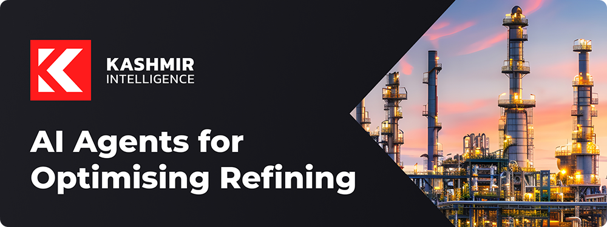

# Welcome to Kashmir Intelligence 👋

## Our Mission 🚀

We're transforming downstream oil and gas refinery operations through advanced multi-agent AI systems, driving unprecedented process optimisation and efficiency.

## Our Approach 🔎

- **Multi-Agent Systems:** Collaborative AI for complex refinery processes
- **Real-time Optimisation:** Continuous adaptation to changing dynamic conditions
- **Data Integration:** Unifying diverse and multi-dimensional process data sources
- **Predictive Analytics:** Anticipating and preventing process inefficiencies

## Our Impact 💡

- Enhanced Operational Efficiency
- Reduced Downtime and Maintenance Costs
- Improved Product Quality and Yield
- Decreased Environmental Footprint

## Join Us 🤝

Partner with us to revolutionize your refinery operations and lead the industry in AI-driven optimization.

**Contact:** [sam@kashmirintelligence.com](mailto:sam@kashmirintelligence.com)  
**Website:** [kashmirintelligence.com](https://www.kashmirintelligence.com)
**Slack Channel:** [Kahsmir Intelligence Open Source](https://join.slack.com/t/ki-opensource/shared_invite/zt-2rl9f552a-rgdTYrbVxX7clQed9FEXnw)