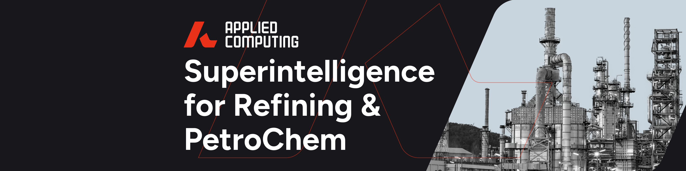

# Welcome to Applied Computing 👋

## Our Mission 🚀

We're transforming heavy industry operations (particularly focused on downstream oil and gas refinery operations) through advanced multi-agent AI systems, driving unprecedented process optimisation and efficiency.

## Our Approach 🔎

- **Multi-Agent Systems:** Collaborative AI for complex refinery processes
- **Real-time Optimisation:** Continuous adaptation to changing dynamic conditions
- **Data Integration:** Unifying diverse and multi-dimensional process data sources
- **Predictive Analytics:** Anticipating and preventing process inefficiencies

## Our Impact 💡

- Enhanced Operational Efficiency
- Reduced Downtime and Maintenance Costs
- Improved Product Quality and Yield
- Decreased Environmental Footprint

## Join Us 🤝

We welcome researchers, developers, engineers, and industry partners to join our mission! Whether you're contributing code, sharing expertise, or implementing solutions, help us revolutionise Process Engineering R&D and make applied AI in heavy industry accessible to all. Together, we'll lead the way in AI-driven optimization for a more efficient and sustainable future.

- **Contact:** [sam@appliedcomputing.com](mailto:sam@appliedcomputing.com)  
- **Website:** [appliedcomputing.com](https://www.appliedcomputing.com)
